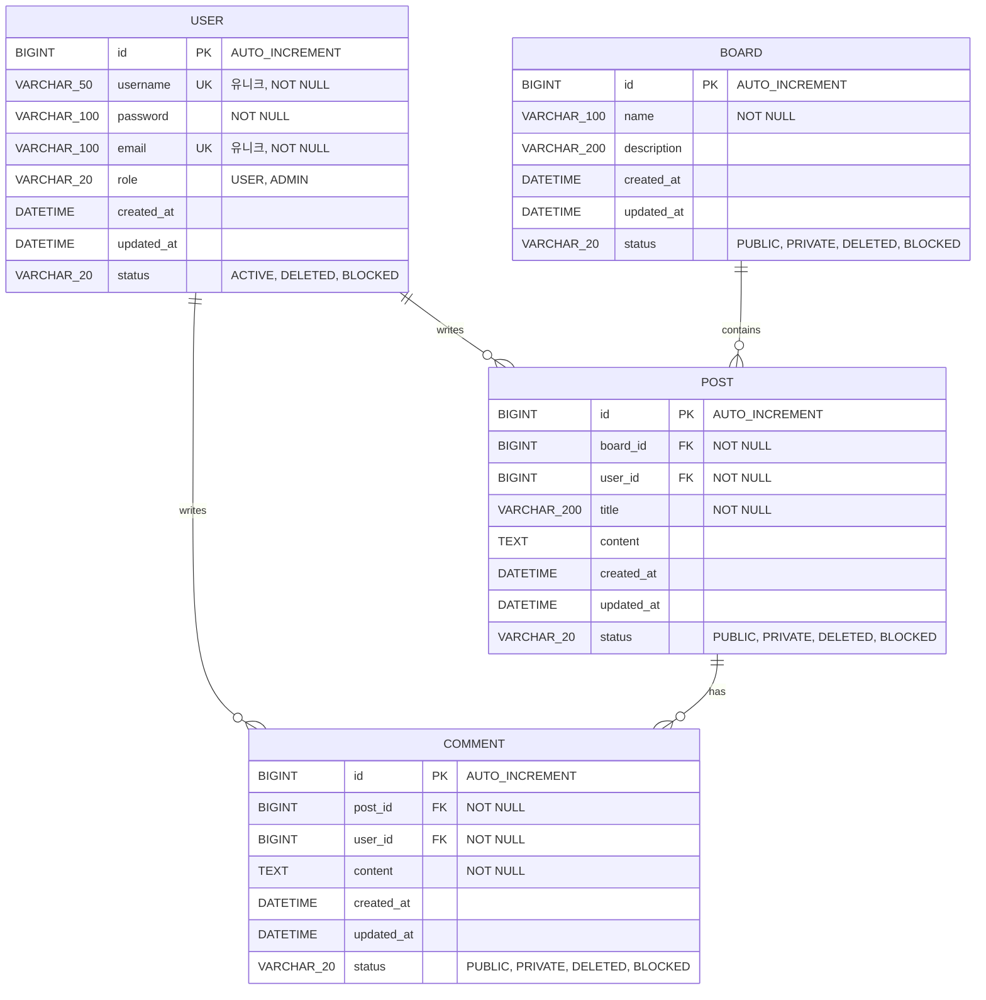

# 🗂️ Spring Advanced Board

> **Spring framework의 고급 기능들을 학습하고 구현하는 실명 게시판 시스템**

- [주요 기능](#-주요-기능)
- [기술 스택](#-기술-스택)
- [ERD 설계](#-erd-설계)
- [프로젝트 구조](#-프로젝트-구조)

## 🎯 프로젝트 소개

Spring Advanced Board는 **Spring Framework의 고급 기능**들을 실무에 적용하고 학습하기 위한 게시판 시스템입니다. 실명 기반의 투명한 커뮤니케이션을 지원하며, JPA 연관관계 매핑, Cascade 전략, Lazy Loading 등 Spring의 핵심 개념들을 실제 프로젝트에 적용했습니다.

### 💡 프로젝트 목표

- Spring Boot 고급 기능 학습 및 적용
- JPA/Hibernate ORM 실무 활용
- RESTful API 설계 및 구현
- 데이터베이스 설계 및 최적화

## ✨ 주요 기능

### 🏢 게시판 관리
- **다중 게시판 개설**: 자유게시판, 공지사항 등 목적별 게시판 생성
- **권한 설정**: PUBLIC, PRIVATE 게시판 구분
- **상태 관리**: 활성(ACTIVE), 삭제(DELETED), 차단(BLOCKED)

### 📝 게시글 관리
- **CRUD 기능**: 게시글 작성, 조회, 수정, 삭제
- **게시판별 분류**: 각 게시판에 맞는 게시글 관리
- **상태 제어**: PUBLIC, PRIVATE, DELETED, BLOCKED
- **작성자 정보 연동**: User 엔티티와의 연관관계

### 💬 댓글 시스템
- **계층형 댓글**: 게시글에 대한 댓글 작성
- **실명 표시**: 작성자 실명 기반 댓글
- **댓글 관리**: 수정, 삭제 기능

### 👤 사용자 관리
- **회원 인증**: 사용자 등록 및 로그인
- **역할 기반 권한**: USER, ADMIN 역할 구분
- **계정 상태 관리**: ACTIVE, DELETED, BLOCKED

## 🛠 기술 스택

### Backend Framework
```
Spring Boot          3.5.8
Java                 17
Spring Data JPA      (Hibernate)
Spring Security      (구현 예정)
```

### Database
```
MySQL                8.0
```

### Build Tool
```
Gradle               8.x
```

### 주요 의존성
- **Lombok**: 보일러플레이트 코드 감소
- **Spring Web**: RESTful API 구현
- **Spring Data JPA**: ORM 및 데이터 액세스
- **MySQL Connector**: MySQL 데이터베이스 연결

## 📊 ERD 설계

### ERD 다이어그램



### 📌 테이블 관계

| 엔티티 | 연관 대상 | 관계 유형 | 매핑 전략 | 설명 |
|--------|-----------|-----------|----------|------|
| User | Post | 1:N | `@OneToMany` | 한 유저가 여러 글 작성 |
| User | Comment | 1:N | `@OneToMany` | 한 유저가 여러 댓글 작성 |
| Board | Post | 1:N | `@OneToMany` | 하나의 게시판에 여러 글 포함 |
| Post | Comment | 1:N | `@OneToMany` | 하나의 글에 여러 댓글 포함 |

### 🔑 인덱스 설계

최적화를 위해 다음 컬럼에 인덱스가 설정됩니다:
- `user.username` (UK)
- `user.email` (UK)
- `post.board_id` (FK)
- `post.user_id` (FK)
- `comment.post_id` (FK)
- `comment.user_id` (FK)

## 📁 프로젝트 구조

```
board_advanced-board/
├── src/
│   ├── main/
│   │   ├── java/
│   │   │   └── com/
│   │   │       └── board/
│   │   │           ├── controller/      # REST API 컨트롤러
│   │   │           ├── service/         # 비즈니스 로직
│   │   │           ├── repository/      # JPA 리포지토리
│   │   │           ├── entity/          # JPA 엔티티
│   │   │           ├── dto/             # 데이터 전송 객체
│   │   │           └── config/          # 설정 클래스
│   │   └── resources/
│   │       ├── application.properties   # 애플리케이션 설정
│   │       └── static/                  # 정적 리소스
│   └── test/                            # 테스트 코드
├── build.gradle                         # Gradle 빌드 설정
└── README.md
```

**💡 상세한 프로젝트 정보**: [Notion 프로젝트 페이지](https://www.notion.so/yoing-/spring-advanced-board-2c0f867dc00480a9a631e1e34ca5fd37)
